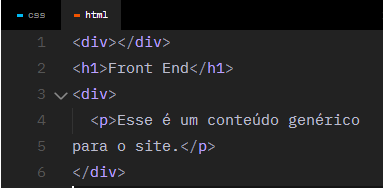
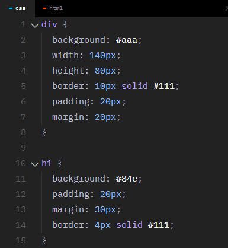
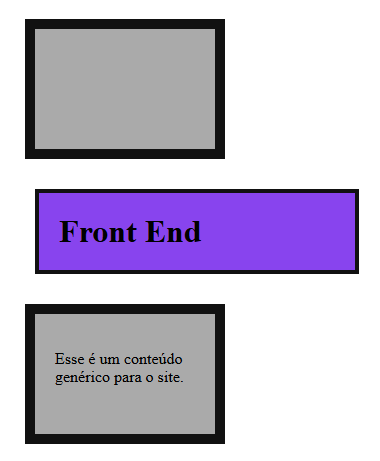

<h1>Link</h1> <br>
Link <br>
Cria uma relação entre um documento HTML e um arquivo de estilo CSS.<br>
<br>
rel <br>
Define o tipo de arquivo (stylesheet para CSS). É possível linkar outros também como favicons.<br>
<br>
href <br>
Define o caminho do arquivo.

```<link rel="stylesheet" href="/style.css"/>```

-------

<h1> CSS Anatomia </h1><br>
Seletor <br>
Seleciona o elemento(s) que deve ser estilizado.<br>
<br>
Bloco CSS<br>
Engloba as propriedades { } que serão aplicadas ao seletor.<br>
<br>
Propriedade<br>
Define o que será alterador.<br>
<br>
Valor <br>
Define o valor do novo estilo.

----------------------------

<h1> Seletores </h1> <br>

h1, p <br>
A vírgula permite selecionarmos múltiplos elementos para a aplicação de um mesmo estilo. <br>

p a <br>
Seleciona o ```a``` que tiver um ```p``` como elemento pai (não precisa ser filho direto).


id <br>
Atributo HTML que adiciona um identificador ```único``` na tag. Esse identificar pode ser utilizado no CSS para selecionarmos o elemento: ```#nomeid``` 

class <br>
Atributo HTML que adiciona um identificador reutilizável na tag. Esse identificar pode ser utilizado no CSS para selecionarmos o(s) elemento(s): ```.classe```

------------------

<h1> Background e Cores </h1>

Background <br>
background ou background-color, muda a cor de fundo do elemento.

```
 h1 {
  background: black; (logo a cor de fundo será preta)
  color: white; (cor do texto H1 será branca)
}

a {
  background-color: seagreen; (logo a cor de fundo será um verde água)
  color: white; (logo a cor do texto a será branca)
}
```

Hexadecimal <br>
hexadecimal, a cor é representada através de um código de 6 caracteres que vão de 0 até F.<br>
Exemplo: ```#84e = #8844ee```

RGBA <br>
```rgba(0, 0, 0, 1);```<br>
O rgba é uma função que recebe os valores de r (red), g (green), b (blue) e a (alpha). O rgb vai de 0 até 255 e o alpha vai de 0 até 1.

----------------
<h1>Box Model</h1>
Caixas 
Uma interface web é composta de diversas caixas que organizam o conteúdo.

<br>


Content (conteúdo)<br>
Define a largura inicial da caixa (salvo elementos de bloco).

Padding (preenchimento)<br>
Separa o conteúdo das bordas da caixa. É a margem interna.

Border (borda)<br>
Define bordas para a caixa.

Margin (margem)<br>
Define a distância entre uma caixa e outra.

Width (largura)<br>
A largura total da caixa, por padrão é o somatório do conteúdo + padding (left/right) + border (left/right).

Height (altura)<br>
A altura total da caixa, por padrão é o somatório do conteúdo + padding (top/bottom) + border (top/bottom).

 <br>
----------
<h1>Pixel</h1>

Unidade de referência:<br>
É a unidade de referência da Web, pois as telas são desenvolvidas em pixels. 

Monitores:<br>
Um monitor de: 3840 (largura em px) x 2160 (altura em px) = 8.294.400.

px em CSS:<br>
No CSS o pixel (px) é uma unidade de referência e não representa 1 pixel exato do seu dispositivo (é adaptável em relação à densidade da tela).


<br>
Cada bloco ou quadrado da imagem representa UM pixel.

-----------
<h1>div</h1> 

A ```<div>``` é um elemento de bloco block genérico que serve para auxiliar no posicionamento dos elementos/conteúdo na tela.
Existem também elementos semânticos como main, section, nav e outros que veremos em outras aulas.

  