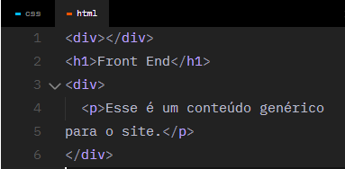
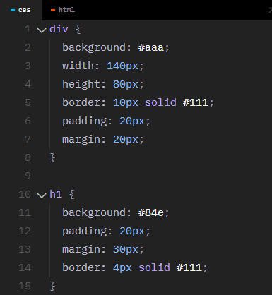
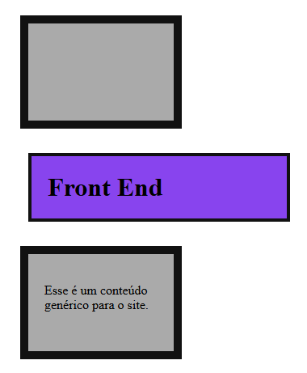

----------------
<h1>Box Model</h1>
Caixas 
Uma interface web é composta de diversas caixas que organizam o conteúdo.

<br>


Content (conteúdo)<br>
Define a largura inicial da caixa (salvo elementos de bloco).

Padding (preenchimento)<br>
Separa o conteúdo das bordas da caixa. É a margem interna.

Border (borda)<br>
Define bordas para a caixa.

Margin (margem)<br>
Define a distância entre uma caixa e outra.

Width (largura)<br>
A largura total da caixa, por padrão é o somatório do conteúdo + padding (left/right) + border (left/right).

Height (altura)<br>
A altura total da caixa, por padrão é o somatório do conteúdo + padding (top/bottom) + border (top/bottom).

 <br>
----------
<h1>Pixel</h1>

Unidade de referência:<br>
É a unidade de referência da Web, pois as telas são desenvolvidas em pixels. 

Monitores:<br>
Um monitor de: 3840 (largura em px) x 2160 (altura em px) = 8.294.400.

px em CSS:<br>
No CSS o pixel (px) é uma unidade de referência e não representa 1 pixel exato do seu dispositivo (é adaptável em relação à densidade da tela).


<br>
Cada bloco ou quadrado da imagem representa UM pixel.

-----------
<h1>div</h1> 

A ```<div>``` é um elemento de bloco block genérico que serve para auxiliar no posicionamento dos elementos/conteúdo na tela.
Existem também elementos semânticos como main, section, nav e outros que veremos em outras aulas.

  