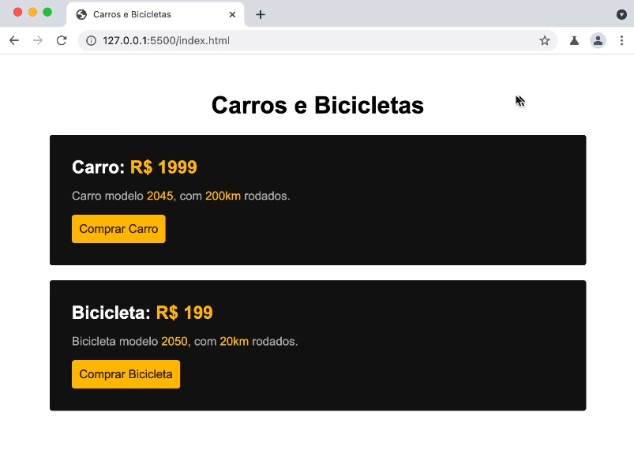

O intuito é chegar nesse resultado.

Primeiro passo: Definir o título do documento. 
Segundo passo: Definir o título do texto. 
Terceiro passo: Criação da div, e da sua classe. 
Quarto passo: Criação do nome do produto. 
Quinto passo: Criação da descrição do produto. 
Sexto passo: Criação do botão e da sua classe. 
Sétimo passo: Linkar o css no html e a estilização da div. 