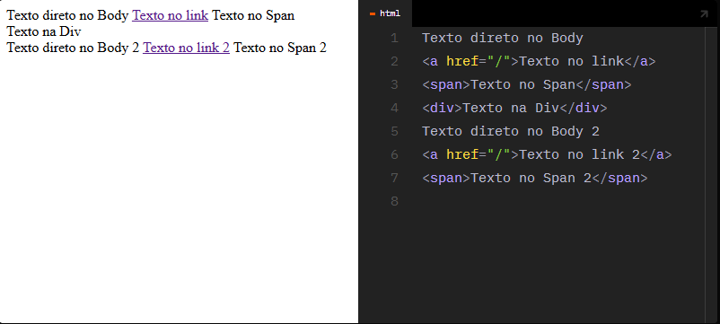
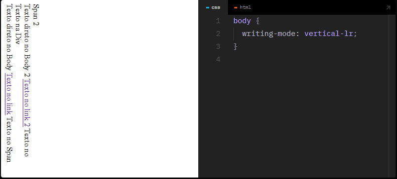
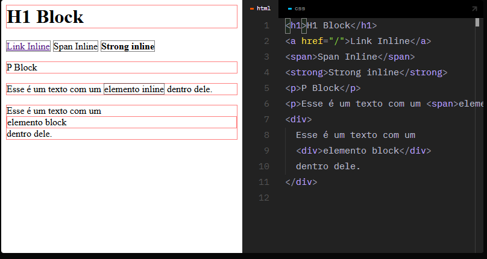
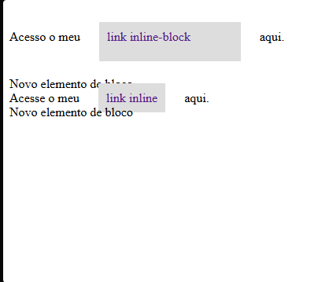
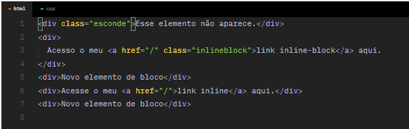
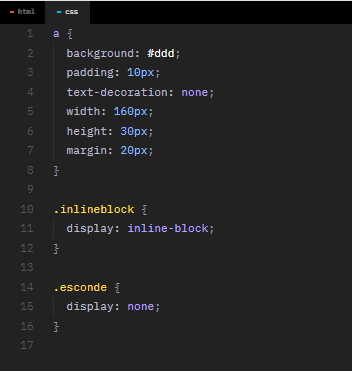

<h1>Display</h1>
Fluxo do Layout: 

O fluxo do layout no HTML ocorre conforme o modo de escrita definido. Por padrão, de cima para baixo da esquerda para a direita.

span: 
Tag genérica que não possui nenhum estilo pré-definido/semântica. É equivalente a uma div, mas sem o display block.

----
Ao modificar o modo de escrita, o fluxo também é modificado.

esse vertical-lr, o lr significa left e right.

----

Display inline e block: 
Define como a caixa (box model) irá se comportar.

inline: 
Respeita o fluxo da escrita sem iniciar uma nova linha, não é possível definir valores de width, height, margin (top/bottom) e etc. É o estilo padrão.

block: 
Inicia uma nova linha e não permite que outros elementos sejam posicionados em sua linha. Aceita todas as propriedades do box model. Estilo inicial de elementos como h1, p, div e outros.

none e inline-block: 

none: 
Remove o elemento completamente da tela.

inline-block: 
O elemento continua inline, mas passa a receber as propriedades do box model.

  