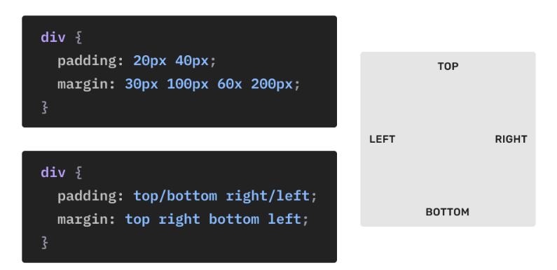
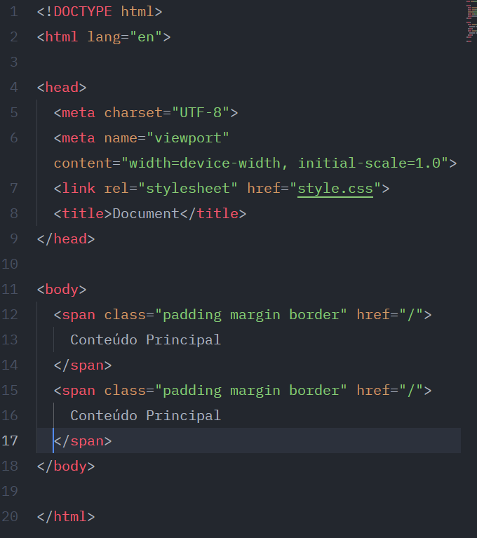
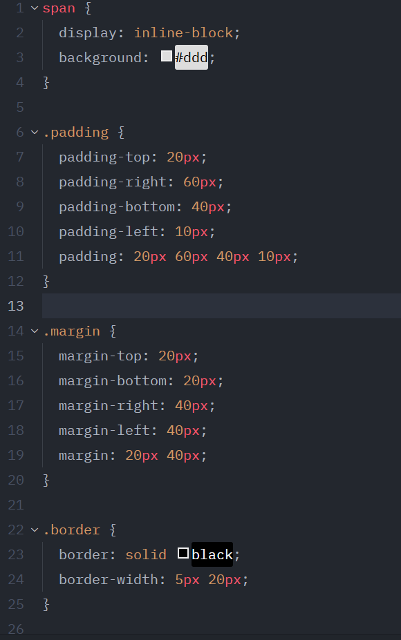
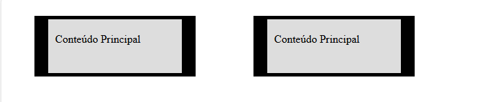

<h1>Top, Right, Bottom, Left</h1>

Top, Right, Bottom, Left: 
Propriedades como margin, padding e border permitem definirmos valores diferentes para cada um dos lados da caixa (box model).

--------

Nas imagens abaixo podemos ver exemplos do código bruto em si, e logo após temos a imagem criada, onde conseguimos ver o que aplicamos.

°HTML
  

-----------

°CSS
  

-----------

°Imagem final
  

-----------

inline e block: 
Os valores de top, bottom, right e left são relativos ao documento. Para valores relativos a caixa (box) que pode ser influenciada pelo modo de escrita, use inline-start, inline-end, block-start, block-end.